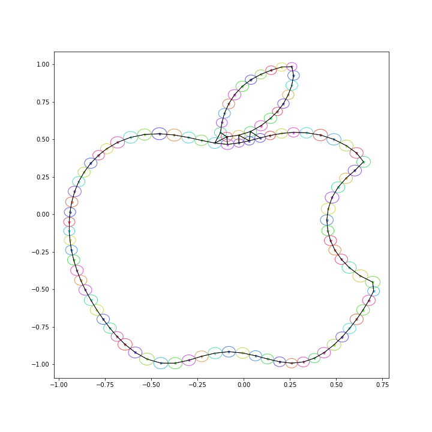

# The Fourier Transform: Create mesmerizing animations from simple images.

The Fourier transform has many useful applications across an array of fields,
from heat transfer all the way down to quantum mechanics, and though useful,
it also forms approximations which can appear quite elegant.
Through the use of a Fourier approximation, as well as some interesting
methods from machine learning and image processing, the function provided
in this repository allows a user to take a simple image, like this silhouette
of a deer:


and convert it into an animation like so:


This may appear to be a strange way to draw an outline, but the real
point of interest comes from the underlying mathematics. The rotating arms
in the animation are each moving at a fixed speed. The first segment has a
rotational velocity of w=0, the next of w=1, then w=-1, then w=2, and so on.
By themselves, they would just be drawing circles. However, we can add
them together, and by only varying their length and starting angle,
can produce an approximation for any ordered set of points (like an outline).


### Motivation

The original motivation for the project came from the following video from
3Blue1Brown:
https://www.youtube.com/watch?v=r6sGWTCMz2k&vl=en

This provides a fantastic explanation of the math driving this type
of approximation and gives some beautiful examples of it in action.

However, the approximation required one to have access to an ordered set
of points which represent the image to be approximated.

It's not necessarily obvious how a user may come across data like this,
and I wondered if it would be possible to completely automate the
generation of these points, beginning with an image file, and then use
them to produce the Fourier approximation.


### How it Works

Let's begin with an image


First, the algorithm uses a Sobel filter to detect edges in the image.


Then, using K-Means clustering, the point comprising the edges are collapsed
into a series of nodes. This reduces the image outline to a much smaller
number of points to be approximated.

Also, 'connections' are created between points which are close.
The path of the final is forced to follow along these connections.
This helps guarantee that the final path traced by the Fourier approximator
will be coherent and more likely follow the true outline of the image.



Finally, a best-first search algorithm is used to connect the points
into a final path, which is then traced by the Fourier approximator.


### Approximation Order
When performing the approximation, the number of terms (order) matters.
The more complexity one wishes to represent, the more terms will be necessary.

The following table shows how the approximation of a maple leaf improves
as order is increased.

N=5                        |  N=10
:-------------------------:|:-------------------------:
     |  
N=20                       |  N=40
    |  
N=80                       |  N=200
    |  


### Try it Yourself!
Before running the following python modules need to be installed in your
environment:

`numpy`
`matplotlib`
`sklearn`
`seaborn`
`pillow`
`skimage`
`six`

Begin by placing an image into the `image/` folder. The image must be a
`.png` or a `.jpg`.

Then, from `fourier_xform/`, run the following in python:
```python
from main import fxform
fxform('image_name_without_path_or_extension')
```

To change the approximation order to, say, 50, use the following argument:
```python
fxform('image_name', N=50)
```


### License
GNU GENERAL PUBLIC LICENSE
